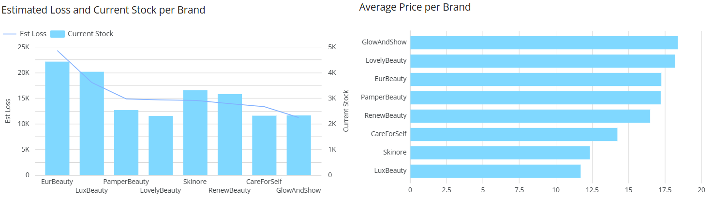
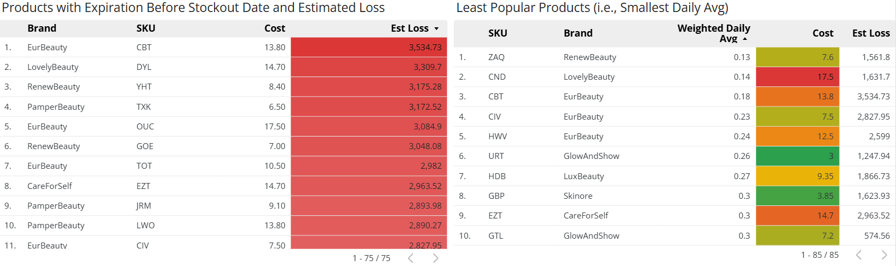
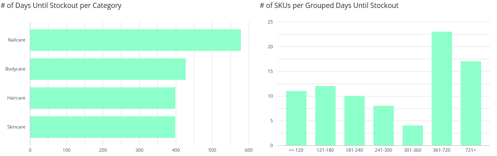
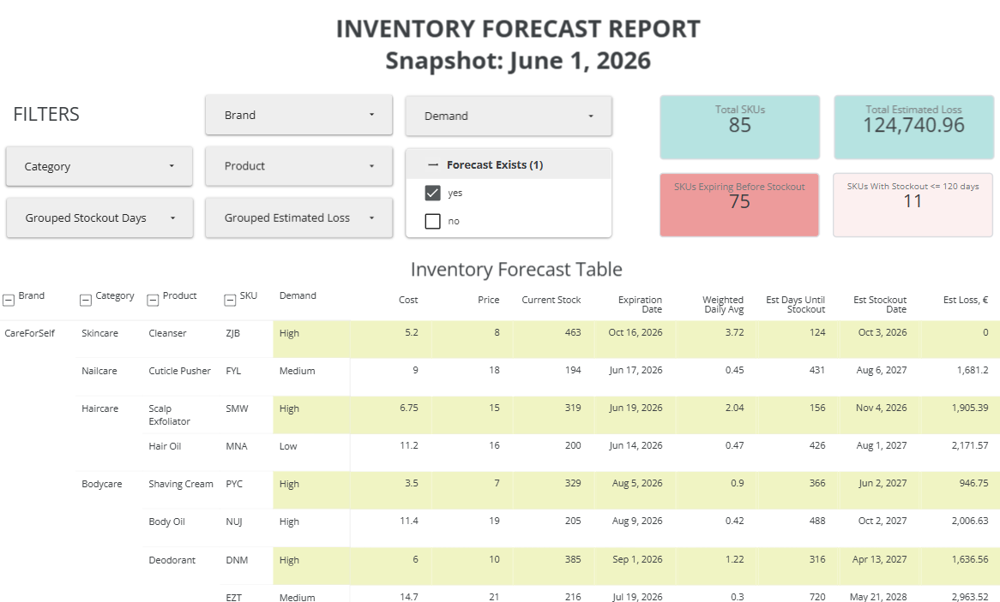

# inventory-forecast

**Inventory Forecast Project**

**Tools Used: Python, BigQuery, Data Studio**

## Problem
**Inventory.** Every company that produces and sells products directly or indirectly has to deal with it. However, I noticed that even the most well-known companies sometimes lack an efficient way to track it and predict which items will or will not last based on historical data.

What happens if you order too many items? What happens if you end up with an unbelievable amount of items expiring tomorrow? I guess impossible to know if you do not keep track of these things.

## Structure
To build this inventory forecast, I used a Python notebook to generate the underlying data (i.e., 3 tables) needed. The data was then uploaded to BigQuery, where the actual forecast logic and key metric calculations were made. These metrics include the weighted daily sales average, estimated days until stockout, estimated stockout date, and estimated financial loss. The calculated results were exported and connected to Data Studio (previously known as Looker Studio), to build an interactive dashboard and key insights.

## Data
The forecast relies on three core tables:
| Table  | Description |
| ------------- | ------------- |
| `products`  | Contains 150 unique SKUs across 8 brands, encompassing 46 products and 4 categories (nailcare, bodycare, skincare, haircare). |
| `orders`  | Contains 10,000 simulated orders ranging from 2025-06-01 to 2026-06-01. |
| `inventory`  | A static snapshot (as of 2026-06-01) of the current stock level and expiration date for each SKU. |

## Assumptions
- **Static Stock:** Inventory data, including current stock levels and expiration dates, is a static snapshot and does not change. In a real-world production environment, this data would need to be updated frequently.
- **Predefined Attributes:** The number of SKUs, products, orders, and their relative weights/importance are predefined and fixed.
- **Single-Item Orders:** Order IDs are unique and contain a single SKU (i.e., one row per order).
- **SKU Uniqueness:** SKUs are entirely unique, but they can share identical product names and categories across different brands.
- **Fixed Pricing:** Product prices remain constant and exclude the fact that companies might have bundles, deals or promotional discounts.

## Methodology

### 1. Data Generation (Python)
Instead of sourcing a generic dataset, I wanted to brush up on my Python skills and generate the exact columns needed for this project. 

Each table was built around the 150 unique SKUs along other information that might be important or interesting to see. To make the dataset seem like a real-world market and add some complexities, I introduced randomness and custom weights to skew specific distributions. For instance:

- Some products were labeled as popular (high demand) so they would be ordered more frequently.
- The cost of producing a product is always lower than what the customer is charged (i.e., the retail price). 
- Quantities were weighted so customers are more likely to order smaller batches. 
- Certain date ranges were simulated to appear more frequently to simulate realistic seasonal trends and demand patterns.

### 2. Inventory Forecast and Calculations (BigQuery)
- **Weighted Daily Demand Rate**: Instead of calculating a flat weekly or monthly daily sales average, we want some variety. What if there was a huge sale for a certain product last week (not in our case, we do not do discounts)? Or what if there was a blizzard in the middle of the summer, where people actually did not need or use sunscreen (not recommended)? To avoid these edge cases, I put emphasis on items sold the past week (i.e., 2026-05-25 - 2026-06-01), then some emphasis on the past 14 days, and least (but still significant) emphasis on the past 30 days, meaning:

`Weighted Daily Avg = (0.5 * 7-Day Daily Avg) + (0.3 * 14-Day  Daily Avg) + (0.2 * 30-Day Daily Avg)`.

- **Days Until Stockout and Estimated Stockout Date**: To estimate how many days it will take for a product to run out, we take the current stock for that product and divide it by the calculated daily demand rate. To get the exact date that the product may run out on, we add that estimated number of days to our current static date (i.e., 2026-06-01).
- **Estimated Loss**: Sometimes a company might overestimate the popularity of a certain product, which can depend on the season, current trends, and other factors. In such cases, there might be some products that are sitting in the warehouse but have reached their expiration date. To calculate the loss of such products, we figure out the number of items estimated to remain after expiration and multiply that amount by the cost.

### 3. Dashboard (Data Studio)
The dashboard introduces stakeholders to the main filters to choose from and four scorecards that provide a general summary of the findings. The `Forecast Exists` filter reduces noise by removing the rows with no estimations due to not having any sales in the past 30 days. The inventory forecast table provides any necessary information for each brand and products, whilst other visualizations (i.e., barcharts, a linegraph, and tables) unveil in-depth details by brand, product, and category.

## Key Findings
- **Brands:** 

EurBeauty has the largest current stock as well as the biggest estimated loss, whilst GlowAndShow has one of the lowest stock levels and lowest estimated losses. These tendencies showcase that brands with a bigger stock might have an excessive amount of products, thus leading to a substantial loss.
The average price per brand graph shows that the GlowAndShow brand in fact has, on average, higher prices per product. Similarly, the second highest brand in terms of estimated loss, LuxBeauty, has the cheapest products overall. These findings suggest that a higher price does not necessarily indicate a bigger loss.
To minimize the loss, certain brands should decrease their order volumes and potentially order in smaller batches more often, if needed.
- **Products**:

 In terms of estimated loss, PamperBeauty and EurBeauty account for 3 out of the top 10 products with the highest estimated losses each. Looking at the daily average sales, EurBeauty has 3 products that appear in the top 5, while GlowAndShow appears twice in the top 10. In particular, the product estimated to cause the highest loss, CBT, ranks third for the lowest daily average sales. These results reveal that EurBeauty and GlowAndShow products warrant closer inspection to minimize estimated loss and increase sales. Whilst it might seem that a higher cost could cause a higher estimated loss, in terms of popularity we cannot pinpoint a single trend that would cause concern, as higher costs do not necessarily correlate with a higher estimated loss.
- **Category:**
 
The nailcare category, on average, has the most days estimated until stockout, with at least 140 days more than the other categories. The remaining categories have similar results. Overall, the graph shows that the estimated days are all above 300 days, meaning that the majority of products, on average, have around 10 months of supply.
The vertical bar indicates that 40 products, which is roughly half of the products that have a forecast, have enough stock for at least a year. 11 products require additional attention from stakeholders as they have less than four months left until their estimated stockout.

## Dashboard
The dashboard as a PDF file can be found in the `Dashboard` folder. Alternatively, you can find the actual interactive dashboard by clicking the following link: https://datastudio.google.com/s/i1eJ1g0pgRk

## How to Run
To recreate the project \*:
1. Run the `Python/generate_data.ipynb` file to generate the three CSV files.
2. Upload the files (or the ones from `Data/Tables (Python Output)`) to BigQuery and run the `SQL/forecast_query.sql` query.
3. Connect the output to Data Studio to create a report.

\* *The output will differ during every run, as the generated information for each CSV file will not be the same.*